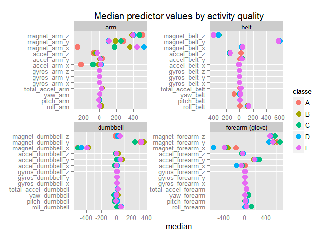
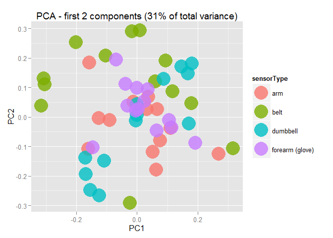
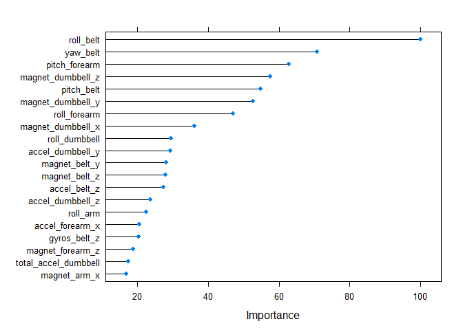
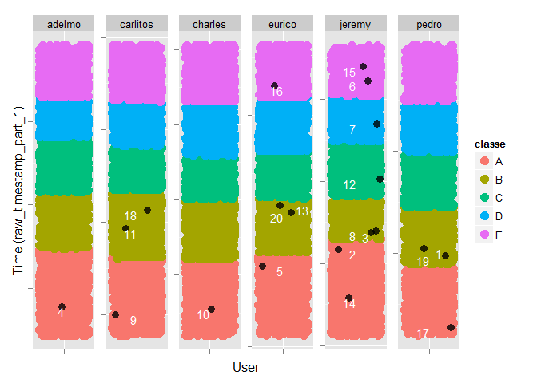

# Prediction assignment writeup
Lorenzo Greggio  
december 2015  
## Assignment description
Using devices such as Jawbone Up, Nike FuelBand, and Fitbit it is now possible to collect a large amount of data about personal activity relatively inexpensively. These type of devices are part of the quantified self movement – a group of enthusiasts who take measurements about themselves regularly to improve their health, to find patterns in their behavior, or because they are tech geeks. One thing that people regularly do is quantify how much of a particular activity they do, but they rarely quantify how well they do it. In this project, your goal will be to use data from accelerometers on the belt, forearm, arm, and dumbell of 6 participants. They were asked to perform barbell lifts correctly and incorrectly in 5 different ways. More information is available from the website [here](http://groupware.les.inf.puc-rio.br/har) (see the section on the Weight Lifting Exercise Dataset).  
The goal of your project is to predict the manner in which they did the exercise. This is the "classe" variable in the training set. You may use any of the other variables to predict with. You should create a report describing how you built your model, how you used cross validation, what you think the expected out of sample error is, and why you made the choices you did. You will also use your prediction model to predict 20 different test cases.

###Data
[Train set](https://d396qusza40orc.cloudfront.net/predmachlearn/pml-training.csv)  

[Test set](https://d396qusza40orc.cloudfront.net/predmachlearn/pml-testing.csv)

## Reading data

I first read both training and test sets and check dimensions on both, assuming files have already been downloaded and placed in current working directory:

```r
origTraining = read.csv("pml-training.csv",
                        na.strings = c("NA","#DIV/0!"),
                        stringsAsFactors = FALSE)
origTesting = read.csv("pml-testing.csv",
                        na.strings = c("NA","#DIV/0!"),
                        stringsAsFactors = FALSE)
dim(origTraining);dim(origTesting)
```

```
## [1] 19622   160
```

```
## [1]  20 160
```


We initially have 159 potential predictors and one target variable for classification. Since I'll be using cross validation to estimate out of sample performance of classification algorithms I'm not going to create any partition out of the original training set.

## Picking predictors  

As a first step I focus on removing predictors with high NA rates. I calculate NA rate for every variable in the training set.


```r
NArates = apply(origTraining,2,
                function(x){mean(is.na(x))})
data.frame(table(NArates))
```

```
##              NArates Freq
## 1                  0   60
## 2  0.979308938946081   67
## 3  0.979359902150647    1
## 4  0.979410865355213    1
## 5  0.979512791764346    1
## 6  0.979563754968912    4
## 7  0.979767607787178    1
## 8  0.979818570991744    4
## 9   0.97986953419631    2
## 10 0.980939761492203    2
## 11 0.983233105697686    1
## 12 0.983284068902253    1
## 13 0.983385995311385    2
## 14 0.983538884925084    1
## 15  0.98358984812965    4
## 16 0.983640811334217    2
## 17                 1    6
```
Notice we have several predictors with very high NA rates. 
I decide to hold only predictors with NA rate being 0, applying variable cuts both on training and testing set.  


```r
hold = which(NArates==0)
training = origTraining[,hold]
testing = origTesting[,hold]
```

I then move to consider variables contained in the first 7 columns.


```r
head(training[,1:7])
```

```
##   X user_name raw_timestamp_part_1 raw_timestamp_part_2   cvtd_timestamp
## 1 1  carlitos           1323084231               788290 05/12/2011 11:23
## 2 2  carlitos           1323084231               808298 05/12/2011 11:23
## 3 3  carlitos           1323084231               820366 05/12/2011 11:23
## 4 4  carlitos           1323084232               120339 05/12/2011 11:23
## 5 5  carlitos           1323084232               196328 05/12/2011 11:23
## 6 6  carlitos           1323084232               304277 05/12/2011 11:23
##   new_window num_window
## 1         no         11
## 2         no         11
## 3         no         11
## 4         no         12
## 5         no         12
## 6         no         12
```

These are descriptive non-measurement variables which would be hardly useful in assessing exercise quality (please refer to **appendix** for further discussion around these variables). I choose to remove all of them, applying variable cuts both on training and testing set.


```r
remove = 1:7
training = training[,-remove]
testing = testing[,-remove]
```

Last, I perform a check for *nearZeroVariance* variables in order to spot uninformative predictors, if any.


```r
library(caret)
```

```
## Loading required package: lattice
## Loading required package: ggplot2
```

```r
nzv = nearZeroVar(training[,-ncol(training)],saveMetrics=TRUE)
sum(nzv$nzv)
```

```
## [1] 0
```

None of the retained predictors have been flagged as being *nearZeroVariance* variables, so there's no need to drop any of those.  
Let's check which are the predictors that made it into the final training set after all cuts:


```r
names(training)
```

```
##  [1] "roll_belt"            "pitch_belt"           "yaw_belt"            
##  [4] "total_accel_belt"     "gyros_belt_x"         "gyros_belt_y"        
##  [7] "gyros_belt_z"         "accel_belt_x"         "accel_belt_y"        
## [10] "accel_belt_z"         "magnet_belt_x"        "magnet_belt_y"       
## [13] "magnet_belt_z"        "roll_arm"             "pitch_arm"           
## [16] "yaw_arm"              "total_accel_arm"      "gyros_arm_x"         
## [19] "gyros_arm_y"          "gyros_arm_z"          "accel_arm_x"         
## [22] "accel_arm_y"          "accel_arm_z"          "magnet_arm_x"        
## [25] "magnet_arm_y"         "magnet_arm_z"         "roll_dumbbell"       
## [28] "pitch_dumbbell"       "yaw_dumbbell"         "total_accel_dumbbell"
## [31] "gyros_dumbbell_x"     "gyros_dumbbell_y"     "gyros_dumbbell_z"    
## [34] "accel_dumbbell_x"     "accel_dumbbell_y"     "accel_dumbbell_z"    
## [37] "magnet_dumbbell_x"    "magnet_dumbbell_y"    "magnet_dumbbell_z"   
## [40] "roll_forearm"         "pitch_forearm"        "yaw_forearm"         
## [43] "total_accel_forearm"  "gyros_forearm_x"      "gyros_forearm_y"     
## [46] "gyros_forearm_z"      "accel_forearm_x"      "accel_forearm_y"     
## [49] "accel_forearm_z"      "magnet_forearm_x"     "magnet_forearm_y"    
## [52] "magnet_forearm_z"     "classe"
```

We are left with 52 predictors (which happen to be the original 9x each sensor measurements plus the calculated Euler's angles and total acceleration for each sensor) plus the target *classe* variable.  

## Some data exploration 

In order to grab a sense of how sensor measurements differ by activity quality, I plot median predictor values after summarising them per *classe* variable and converting resulting dataframe to long format with `reshape2` package (main reason for this is to group predictors per sensor type).  


```r
library(dplyr)
d = tbl_df(training)
med = d%>%group_by(classe)%>%summarise_each(funs(median))
library(reshape2)
molten= melt(data.frame(med),id.vars="classe",value.name="median")
molten$sensorType=rep(c("belt","arm","dumbbell","forearm (glove)"),each=65)

g = ggplot(aes(y=variable,x=median,color=classe),data=molten)
g + geom_point(size=4) + 
    facet_wrap(~sensorType,scales="free",ncol=2) +
    theme(axis.title.y=element_blank()) +
    labs(title="Median predictor values by activity quality")
```

 
  
    
Notice how well median values of *magnet_arm_x* represent different activity quality and, on the other hand, how poorly gyroscope median measurement across all axis and sensors discrimininate between *classe* values.  

When coming to explore variance, I run PCA on my predictors.  


```r
myPCA = prcomp(training[,-ncol(training)],center=TRUE,scale.=TRUE)
(myPCA$sdev^2/sum(myPCA$sdev^2))[1:2]
```

```
## [1] 0.1607015 0.1558329
```
First 2 principal components account only for roughly 31% of total variance, but plotting their loadings gives us a view of which are the measurements which mostly drives them. Coloring by sensor type should give some insights regarding which sensors rule the first 2 principal components.  


```r
PCAdf=data.frame(myPCA$rotation)
PCAdf$sensorType=rep(c("belt","arm","dumbbell","forearm (glove)"),each=13)
g = ggplot(aes(x=PC1,y=PC2,color=sensorType),data=PCAdf)
g + geom_point(size=10,alpha=.8) + 
    labs(title="PCA - first 2 components (31% of total variance)")
```

 

We notice how heaviest (both positive and negative) loadings on first 2 principal components come from belt sensor, with dumbbell measurements coming second and being particularly prominent on the negative side of both the principal components.  
This of course only relates to variance explanation and doesn't imply those variables will have better predicting power.  

PCA has been used only as an exploratory technique, prediction tasks will be based on original variables.  


## Fitting a random forest model  

Planning to fit a random forest model, I check for class proportion in *classe* target variable.  


```r
prop.table(table(training$classe))
```

```
## 
##         A         B         C         D         E 
## 0.2843747 0.1935073 0.1743961 0.1638977 0.1838243
```

Even though there seems to be some unbalancing towards the A class, it doesn't look as severe as requiring to throw in any resampling adjustments to correct class imbalance.  
Next, I setup R to allow parallel computation.  


```r
library(doParallel) #running on Windows 7
```

```
## Loading required package: foreach
## Loading required package: iterators
## Loading required package: parallel
```

```r
cl = makeCluster(detectCores()) # check results from detectCores() as it could fail correct detection
registerDoParallel(cl)
```

I plan to fit the model through `train` function available in `caret` package.  
Random forest model has only one tuning parameter, namely *mtry*, defining the number of random predictors which will be available for each tree at each split. I create a dataframe containing the candidate values for the parameter which will be passed later to the `train` function.  
Having 52 predictors, here's how I pick candidate values:  

- very small number (2)  

- floor of square root of number of predictors (7)  

- .5 * number of predictors (27)  

- .75 * number of predictors (39)  

- number of predictors (52), this option being the same as using a **bagging** algorithm with all predictors always available for tree splits.  


```r
tGrid = data.frame(mtry=c(2,7,27,39,52))
```


Next I define how to control the training function:  

```r
resControl = trainControl(method="cv",
                          number=10,
                          returnResamp = "all" #might be useful for further investigation
                         )
```

I will use **10-fold cross validation to estimate out-of-sample accuracy** of the model.   
5 different random forests models will be fitted (one for each *mtry* candidate value I specified earlier) and **accuracy** will be evaluated for each model through cross-validation. The most accurate model between the five will be then chosen and refitted with the full training set, ready to be used to make predictions on new data.   

Since I'm using parallel computation this is where I should specify the *seeds* option (setting seed normally with *set.seed()* won't work with parallel computation) to guarantee full reproducibility of code. It is somehow a more complex procedure which I'm not familiar with yet, so I'm not going deeper into it right now.  


I am now ready to fit the model, avoding use of *formula* method and accepting defaults for maximizing accuracy, as well as default value of 500 trees per forest in the internal call to *randomForest*. 

```r
library(randomForest)
rfFit = train(y=training$classe,
              x=training[,-ncol(training)],
              method="rf",
              tuneGrid=tGrid,
              trControl=resControl)
```

After stopping the cluster for parallel computation, we have a look at results:

```r
stopCluster(cl)
rfFit
```

```
## Random Forest 
## 
## 19622 samples
##    52 predictor
##     5 classes: 'A', 'B', 'C', 'D', 'E' 
## 
## No pre-processing
## Resampling: Cross-Validated (10 fold) 
## Summary of sample sizes: 17660, 17661, 17659, 17660, 17660, 17660, ... 
## Resampling results across tuning parameters:
## 
##   mtry  Accuracy   Kappa      Accuracy SD   Kappa SD   
##    2    0.9954642  0.9942623  0.0009747413  0.001233406
##    7    0.9964835  0.9955519  0.0010865110  0.001374469
##   27    0.9953623  0.9941335  0.0015655773  0.001980493
##   39    0.9939350  0.9923278  0.0018229937  0.002306520
##   52    0.9900109  0.9873635  0.0026679096  0.003375784
## 
## Accuracy was used to select the optimal model using  the largest value.
## The final value used for the model was mtry = 7.
```
Best model (accuracy-wise) results in being the one built with *mtry* = 7.  

Cross-validation estimated **expected out of sample error** for best model is then 

```r
(1-rfFit$results$Accuracy[2])*100
```

```
## [1] 0.3516456
```
expressed as a percentage.  

Plotting to check for variable importance:  


```r
rfImp = varImp(rfFit)
plot(rfImp,top=20)
```

 

Many (15) of the 20 most important variables come from belt and dumbbell sensors measurements, as we had been hinted by analysis of the first 2 principal components.  

Finally, we are ready to predict activity quality for testing set observations.

```r
finalPrediction = predict(rfFit,testing)
```

##Appendix  

### Trivial solution  


After reading [documentation of the original study](http://groupware.les.inf.puc-rio.br/public/papers/2013.Velloso.QAR-WLE.pdf) and getting familiar with data generating process, it is easy to see how the data was collected.


```r
table(origTraining$cvtd_timestamp,origTraining$user_name)
```

```
##                   
##                    adelmo carlitos charles eurico jeremy pedro
##   02/12/2011 13:32    177        0       0      0      0     0
##   02/12/2011 13:33   1321        0       0      0      0     0
##   02/12/2011 13:34   1375        0       0      0      0     0
##   02/12/2011 13:35   1019        0       0      0      0     0
##   02/12/2011 14:56      0        0     235      0      0     0
##   02/12/2011 14:57      0        0    1380      0      0     0
##   02/12/2011 14:58      0        0    1364      0      0     0
##   02/12/2011 14:59      0        0     557      0      0     0
##   05/12/2011 11:23      0      190       0      0      0     0
##   05/12/2011 11:24      0     1497       0      0      0     0
##   05/12/2011 11:25      0     1425       0      0      0     0
##   05/12/2011 14:22      0        0       0      0      0   267
##   05/12/2011 14:23      0        0       0      0      0  1370
##   05/12/2011 14:24      0        0       0      0      0   973
##   28/11/2011 14:13      0        0       0    833      0     0
##   28/11/2011 14:14      0        0       0   1498      0     0
##   28/11/2011 14:15      0        0       0    739      0     0
##   30/11/2011 17:10      0        0       0      0    869     0
##   30/11/2011 17:11      0        0       0      0   1440     0
##   30/11/2011 17:12      0        0       0      0   1093     0
```

Users were monitored within different 3 to 4 minutes time frames (dates are not ordered in the table but this is not relevant). Let's focus on Adelmo, for instance, and note his performance was monitored on 02/12/2011 from 13:32 to 13:35. 
Furthermore, Adelmo performed the exercises sequentially from A to E, as shown in this table.


```r
adelmo=origTraining[origTraining$user_name=="adelmo",]
table(adelmo$cvtd_timestamp,adelmo$classe)
```

```
##                   
##                      A   B   C   D   E
##   02/12/2011 13:32 177   0   0   0   0
##   02/12/2011 13:33 988 333   0   0   0
##   02/12/2011 13:34   0 443 750 182   0
##   02/12/2011 13:35   0   0   0 333 686
```

If you perform the same calculation for the other users, the same pattern will be shown.  
On this basis, and since we are asked to predict for observations that were contained in the original study dataset (and we are allowed to pick whichever predictors we want), it is trivial to classify the observations using only 1 time based variable, as shown in the plot:


```r
g = ggplot(data=origTraining,aes(x=user_name,y=raw_timestamp_part_1,color=classe))
g + geom_jitter(position=position_jitter(height=0),size=4) + 
    geom_jitter(data=origTesting,position=position_jitter(height=0),size=3,alpha=.8,color="black") +
    theme(axis.text = element_blank()) + 
    facet_wrap(~user_name,scales="free",nrow=1) + 
    labs(x="User",y="Time (raw_timestamp_part_1)") + 
    geom_text(aes(label=X),data=origTesting[-c(1,3,13),],hjust=1,vjust=1,color="white",size=4) +
    geom_text(aes(label=X),data=origTesting[c(1,3,13),],hjust=-1,vjust=1,color="white",size=4) 
```

 

In fact, by constructing a single tree model picking *raw_timestamp_part_1* as the only predictor would accomplish our classification task (code is not evaluated, try it yourself if you wish):

```r
library(rpart)
singleTreeFit = train(classe~raw_timestamp_part_1,
                      data=origTraining,
                      method="rpart")
```

Predictions originated by this single tree model would agree 100% both with the plot and the random forest predictions.  

Of course this approach wouldn't work if we had to extrapolate and generalize beyond the time intervals in the original dataset (**and this motivates the exclusion of first 7 variables in the training set fed to the random forest classifier**).  

Last, it is my opinion this asssignment has been misconceived, please refer to [this post on the forums](https://class.coursera.org/predmachlearn-035/forum/thread?thread_id=39) for further discussion.  

